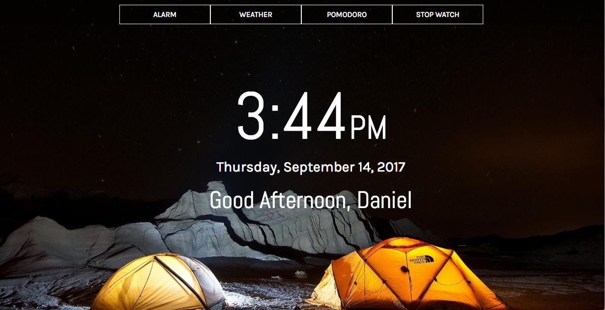
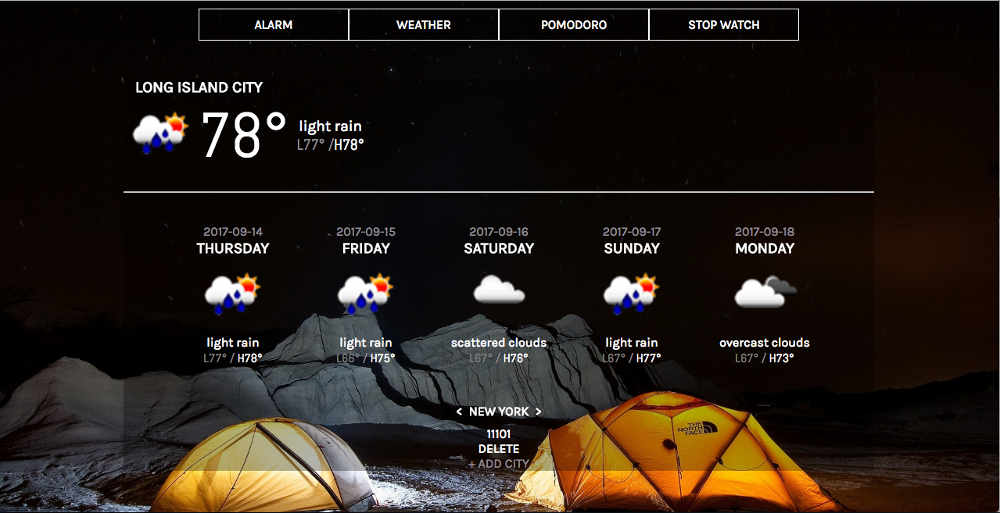
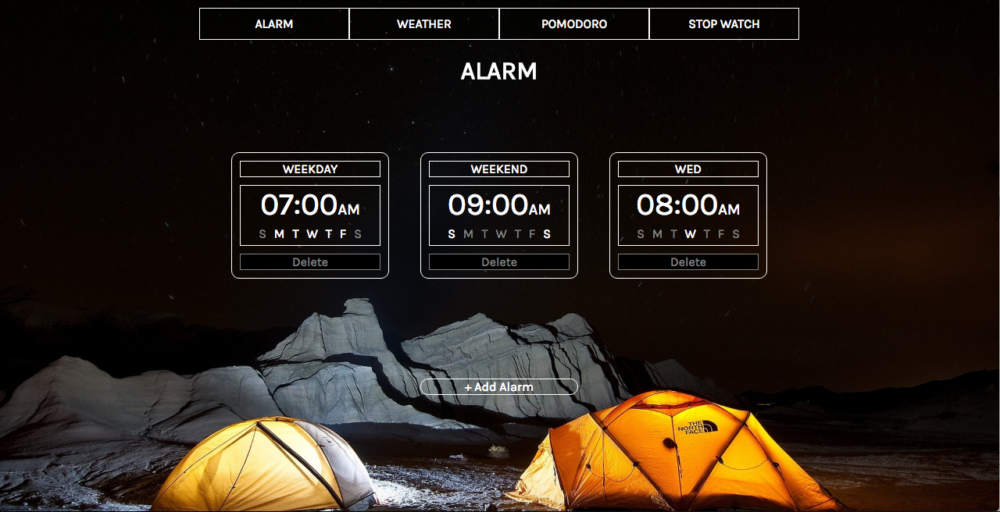
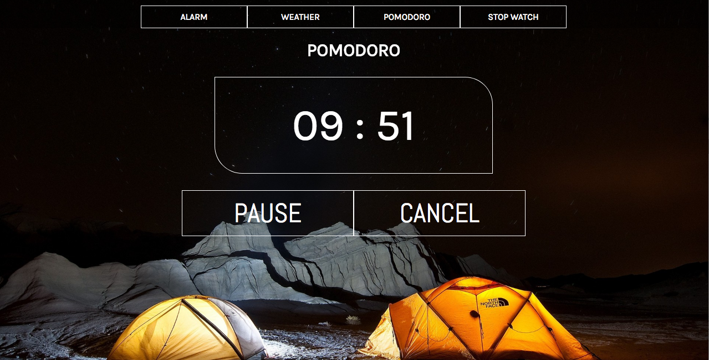
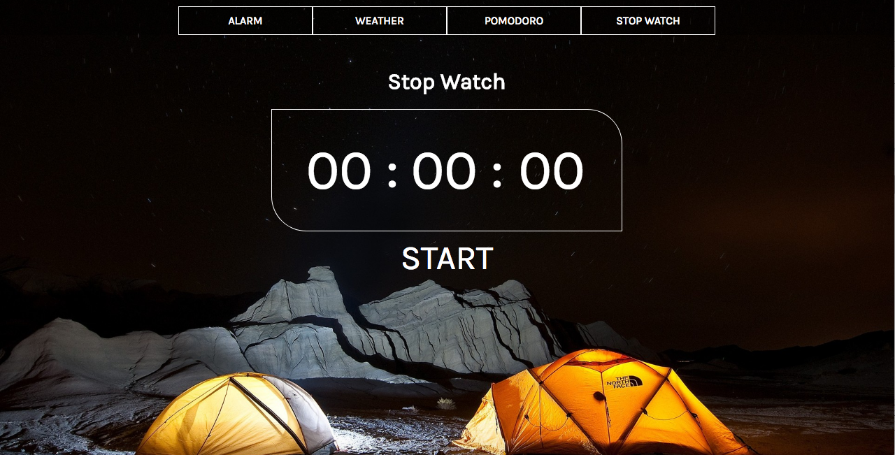
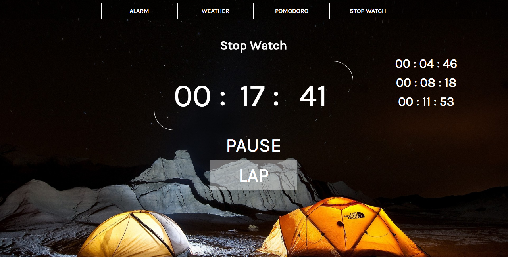
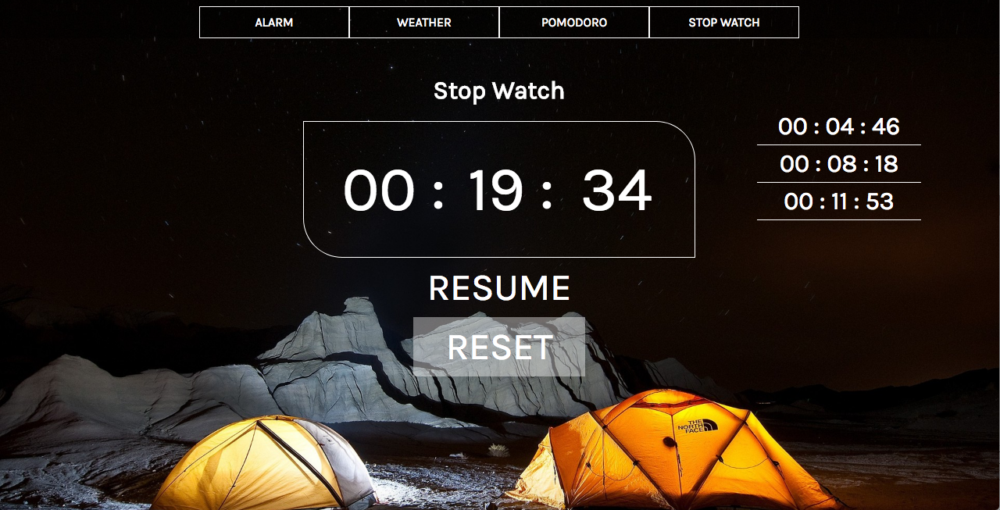

# MY MOMENTUM

A personalized dashboard featuring an time/date, weather data, alarm clock, world clock, pomodoro time and a stopwatch
- Applied CRUD features with React’s virtual-DOM to render and update fetched data from custom built API endpoints
- Built custom Rails API to handle AJAX requests for a fast single page application experience with no refreshes
- Clock, alarm, pomodoro and stopwatch built from scratch by using setInterval to update (milli)seconds
- Built custom Rails APIs to handle fetch requests
- OpenWeatherMap API to retrieve current and daily weather forecast data of a city
- Google Maps Geocoding API to convert zip codes to city names

### TIME/DATE

### WEATHER

### ALARM

### POMODORO

### STOPWATCH

